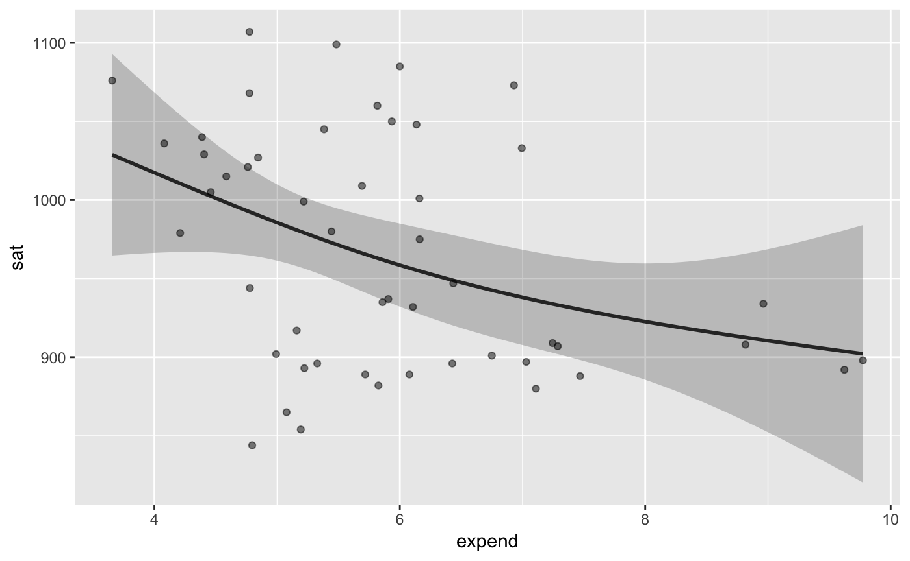
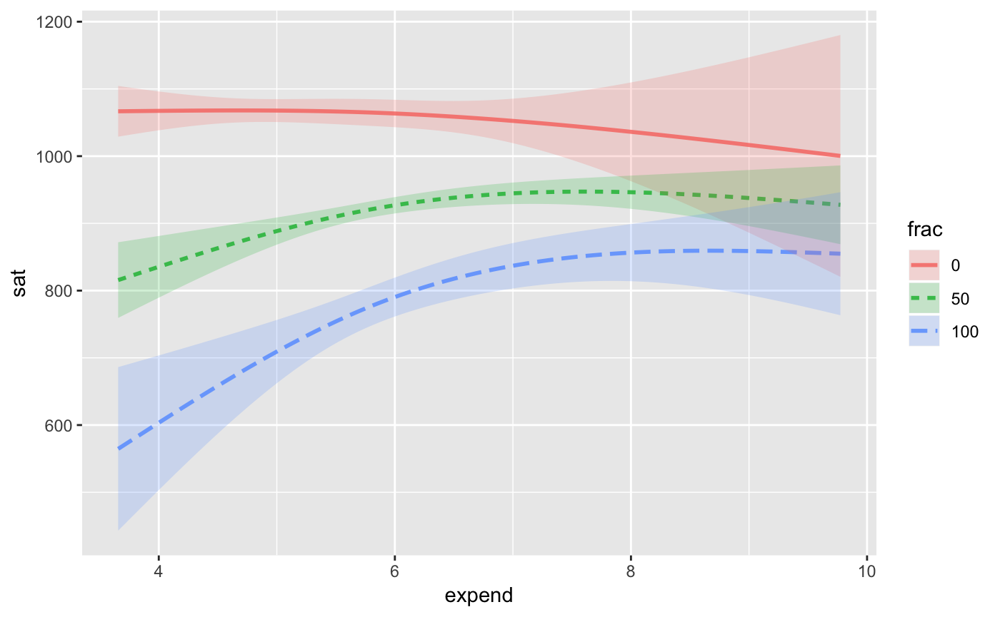

<!-- README.md is generated from README.Rmd. Please edit that file -->

# mosaicModel

The `mosaicModel` package aims to make it easier to display, compare,
and interpret a wide range of statistical models, including the
standards such as `lm` and `glm`, as well as “machine learning”
architectures such as tree-based models (e.g. `randomForest`), k-nearest
neighbors, linear and discriminant analysis, etc.

## Installation

Install the CRAN version of `mosaicModel` in the usual way.

Updates, bug fixes, etc. not yet available on CRAN are posted through
this repository on github. You can install `mosaicModel` from github
with:

``` r
# install.packages("devtools")
devtools::install_github("ProjectMOSAIC/mosaicModel")
```

## Example

One goal of `mosaicModel` is to facilitate teaching statistics in a
modern, model-based way. Part of this is being able to introduce
covariates early. To illustrate, consider scores on the SAT
college-admission test broken down by state. The question is whether
higher per-pupil spending is associated with higher test scores. (This
is one of the examples in the 2017 GAISE College Report.)

``` r
data(SAT, package = "mosaicData")
mod1 <- lm(sat ~ ns(expend, 2), data = SAT)
mod_plot(mod1, interval = "confidence") %>%
  gf_point(sat ~ expend, data = SAT, alpha = 0.5)
```

<!-- -->

A pretty convicing downward trend in the regression curve. The
confidence band suggests, though, that this might be an accidental
pattern. This possibility can be confirmed more formally by looking at
the “effect size,” how a change in the input `expend` in the model
corresponds to a change in output from the model. (Whether `expend` is
causal or not in the real world is another issue, but it’s certainly
“causal” in the model\!)

``` r
mod_effect(mod1, ~ expend, expend = 5, bootstrap = 50)
#> # A tibble: 1 x 4
#>   slope_mean slope_se expend to_expend
#>        <dbl>    <dbl>  <dbl>     <dbl>
#> 1      -23.0     11.5      5         6
```

OK, no strong evidence that expenditure has an impact on SAT scores.

It turns out that at the time the `SAT` data were collected, states
differed markedly in the fraction of high-school students who take the
test. The `frac` is a covariate: a variable in which we are not directly
interested but which might play an important role in the system overall.

``` r
data(SAT, package = "mosaicData")
mod2 <- lm(sat ~ ns(expend, 2) * frac, data = SAT)
mod_plot(mod2, interval = "confidence") 
```

<!-- -->

``` r
mod_effect(mod2, ~ expend, expend = 5, frac = c(10,50,90), bootstrap = 50)
#> # A tibble: 3 x 5
#>   slope_mean slope_se expend to_expend  frac
#>        <dbl>    <dbl>  <dbl>     <dbl> <dbl>
#> 1       5.37     7.47      5         6    10
#> 2      41.2      8.18      5         6    50
#> 3      77.1     15.7       5         6    90
```

A much more nuanced effect. For states where few students take the SAT,
there is little or no dependence of scores on expenditure. Incidently,
those states tend to have very high SAT scores compared to others. The
usual explanation of this is that in such states only the very best
students, often those bound for out-of-state universities, take the SAT.

Among states with low expenditures, there’s notable increase in score
performance as expenditure increases.

### A Classifier

This example shows the display of a classifier model of `Species` on the
famous `iris` data.

``` r
species_mod <- qda(Species ~ Petal.Length + Petal.Width, data = iris)
mod_plot(species_mod, bootstrap = 10, class_level = "virginica") %>% 
  gf_theme(legend.position = "top")
```

<!-- --> That’s a crazy complicated graph for
an introductory example, but stick with me. The graph shows the
classification probability generated by the model that an iris of a
given petal width and petal length is species *virginica*.

  - For petals of width 3 (blue line), regardless of the petal length,
    the classification probability is essentially 100%.
  - For petals of width 1 and length between 3 and 4, the classification
    probability is zero.
  - For petals slightly longer than four or less than two, bootstrapped
    replicates (the several red curves) vary a lot, suggesting that the
    `iris` data do not pin down the model very well.
